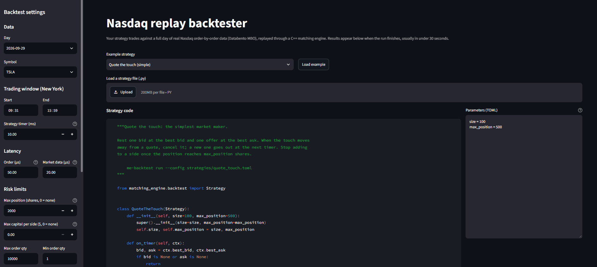
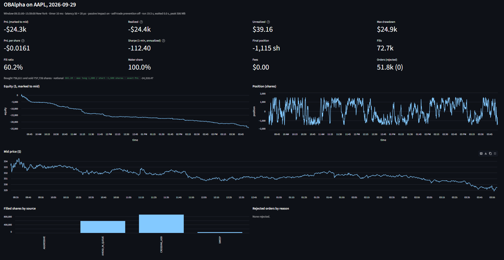

# Nasdaq Replay Backtester


Backtest Python trading strategies against a full day of **real Nasdaq order-by-order
data**, replayed exactly through a **C++20 matching engine**.
- Your orders join the real queues, get filled when real executions reach them, take real
  liquidity when they cross, and reach the exchange after a latency you choose.
- You get PnL, drawdown, fills by source and the full order history.
- Use it from the command line, from Python, or in the browser. In the browser every run
  is sandboxed.

**Live demo: https://52-65-150-242.sslip.io** (temporary). Paste a strategy, pick the
settings, and see the results in about 25 seconds.





## Try it

**In the browser:** open the live demo. The example strategy is already in the editor.

**On your machine,** after getting the data once ([Market data](#1-market-data)):
```bash
pip install '.[backtest]'
me-backtest run --config strategies/ob_alpha.toml                       # the example strategy, AAPL
me-backtest run --strategy my_strategy.py --symbol NVDA --order-latency-us 100

pip install '.[web]'
streamlit run webapp/app.py                                             # the web UI, locally
```

A strategy is a small Python class:
```python
from matching_engine.backtest import Strategy

class JoinTheBid(Strategy):
    def on_timer(self, ctx):                       # every 10 ms of exchange time
        if ctx.best_bid and not ctx.open_orders and ctx.position < 1_000:
            ctx.buy(ctx.best_bid.price, 100)
```

## How it works

```
Databento XNAS.ITCH, MBO schema: every add, cancel and execution on Nasdaq for one day
   │  scripts/fetch_databento.py, convert_mbo.py           14.1 M records, $1.17, downloaded once
   ▼
Parquet columns (prices in 1e-4 $ ticks)
   │  MarketReplayer (C++)                                 rebuilds Nasdaq's book exactly
   ▼
Simulator (C++): your orders in the same book as the real ones
   │  one clock: your orders arriving after latency, real events, your strategy's timer
   ▼
Strategy API (Python): on_timer(ctx) every 10 ms; ctx.book, ctx.buy, ctx.cancel, ctx.pnl …
   │
   ├─ me-backtest CLI ── TOML config, text report, CSV exports
   └─ web UI (Streamlit) ── every run in an isolate sandbox on the server
   ▼
PnL marked to mid, drawdown, position, fills by source, rejects, reconciliation counters
```

Underneath it all is the C++ matching engine's order book (price-time priority,
allocation-free on the order path).

## Components

### 1. Market data
- **Source:** one trading day (2026-09-29) of Nasdaq TotalView-ITCH order-level events for
  AAPL, NVDA and TSLA, from [Databento](https://databento.com). Also Nasdaq's own top of
  book (`mbp-1`), used only to check the replay.
- **Download and storage:** downloaded once, with the cost shown before any spend, and
  stored as Parquet under the git-ignored `data/`.
- **Checked, not assumed:** before building on the feed's semantics, a script measured
  them on the real data. For example, a cancel's size is the amount removed, and every
  execution arrives as trade → fill → cancel.

```bash
pip install '.[data]' && export DATABENTO_API_KEY=...
python3 scripts/fetch_databento.py --date 2026-09-29     # quotes the cost, asks first
python3 scripts/convert_mbo.py --date 2026-09-29
```

### 2. Exact replay
- **What it does:** `MarketReplayer` applies every add, cancel and clear to the engine's
  order book, then compares the rebuilt best bid and ask (price *and* size) with
  Nasdaq's own record after every event.
- **Result:** **2,846,628 comparisons across the three symbols, zero mismatches.** A
  symbol-day replays in 3–7 s.
- **Check it yourself:** `me-backtest validate --date 2026-09-29 --symbols AAPL NVDA TSLA`.

### 3. Strategy simulator
Your orders live in the same book as the real ones. How they fill:

| fill source | what happened |
|---|---|
| `AHEAD_IN_QUEUE` | a real execution hit an order queued behind yours, so it would have hit yours first |
| `CROSSING_ADD` | a real order arrived at a price crossing your resting quote (a stale quote picked off) |
| `AGGRESSIVE` | your order took resting liquidity, which the rest of the replay no longer has |
| `SWEEP` | a real execution ran past an order you had already taken |
| `SELF_TRADE` | your order traded with your own (Nasdaq's default; prevention is opt-in) |

- **Real records are reconciled against the changed book:** a cancel is clamped to what's
  left; a fill continues down the queue.
- **Latency:** order and market-data latency, configurable.
- **Risk limits:** position (shares), capital (USD per side), order size, price distance.
  Limit orders only.
- **Every run is deterministic,** and PnL rebuilt from the fill log matches the
  simulator's exactly.
- The full model and its limits: [`docs/backtesting.md`](docs/backtesting.md).

### 4. Strategy API and CLI
- **API:** subclass `Strategy` and override `on_start`, `on_timer` or `on_end`. `ctx`
  gives the book, your position, cash, PnL, capital deployed, new fills and open orders,
  and `buy`, `sell` and `cancel`.
- **CLI:** `me-backtest run` takes a TOML config, with any setting overridable by a flag.
  It prints a report and can write fills, orders and the equity curve as CSV, or JSON for
  programs.
- **Speed:** a full session (6.5 h at 10 ms, about 2.3 M strategy calls) runs in roughly
  15–20 s.
- The API reference, every config key and every reject reason:
  [`docs/backtesting.md`](docs/backtesting.md).

### 5. Web UI and sandbox
- **Streamlit:**
  - every setting in a sidebar
  - a strategy editor (or `.py` upload) with its parameters as TOML, and an optional
    run label
  - results on the page: metrics, equity, position and mid charts, fills by source,
    rejects, CSV downloads
- **Each run is a separate process in an [isolate](https://github.com/ioi/isolate) box**
  (the sandbox competitive-programming judges use):
  - no network, its own user, an empty environment
  - read-only data
  - limits of 120 s wall, 90 s CPU, 1 GB memory and 64 processes
- **Before any release goes live,** nine hostile strategies are run against it, and each
  must be stopped: network access, a polluted environment, host writes and reads,
  `sys.exit`, a memory hog, a CPU spin, a sleep past the deadline, a fork bomb.
- **Abuse limits per visitor IP:** one run at a time, 30 s apart, 20 an hour. The
  firewall also limits connection floods.

### 6. The matching engine
The C++20 core: a single-symbol limit order book with price-time priority, pre-trade
risk checks, a lock-free event log off the hot path, and Python bindings.

| operation (P50 / P99, 300k samples) | latency |
|---|---:|
| order book add / modify / cancel | 58 / 95 · 91 / 131 · 68 / 102 ns |
| full engine add / modify / cancel (risk, matching, event publish) | 169 / 281 · 278 / 444 · 117 / 294 ns |

What makes it fast:
- **Orders live in a slab, not a hash map.** An order id encodes its slot and a
  generation, so a lookup is an index plus a check, and nothing on the order path
  allocates.
- **Price levels are vectors with the best price at the back.** There is no node-based
  map on the hot path.
- **Events are trivially copyable values in a lock-free single-producer ring** with no
  shared counter. Publishing is a 48-byte copy: no allocation, and no free on another
  thread.
- **Link-time optimization** across the order path, plus a matcher that returns at once
  when nothing can cross.

Architecture, every measurement and its caveats, the design notes, and how to build and
benchmark it: **[`docs/engine.md`](docs/engine.md)**.

### 7. Deployment
- **Server:** an AWS EC2 t4g.small (ARM).
- **HTTPS:** Caddy with a Let's Encrypt certificate on a free sslip.io name.
- **Releases:** every push to `main` that passes CI is built on GitHub's ARM runner and
  sent to the server through a key that can do nothing but deliver a release.
- **The server's own installer gates each release:**
  1. checks it in the sandbox
  2. switches to it
  3. health-checks it
  4. rolls back on failure

  Setup, operations and teardown: [`docs/deploy.md`](docs/deploy.md).

## Results at a glance

| what | result |
|---|---|
| replay vs Nasdaq's own top of book | 2,846,628 comparisons, 0 mismatches |
| full-session backtest | ~2.3 M strategy calls in ~15–20 s; deterministic |
| PnL vs the fill log | identical (to the cent) |
| sandbox, checked on every release | 9 of 9 hostile strategies stopped |
| order book add | 58 ns P50, 95 ns P99 |

## Limitations

**The backtester:**
- **Nasdaq's book only:** no other venues and no hidden liquidity.
- **No reaction model:** it can't know how other traders would have reacted to your
  orders.
- **Gaps:**
  - trading halts aren't handled (the default window, 09:31–15:59, avoids the auctions)
  - one symbol per run
  - limit orders only
  - one day of data offered
- **Passive impact (on by default) leaves size in the book** that Nasdaq had retired.
  The report counts it.

**The engine:**
- single symbol
- `MARKET` orders don't sweep the book
- no IOC, FOK, stop or iceberg orders
- the event ring is single-producer and single-consumer only
- no snapshot or recovery
- risk checks are fat-finger limits only

The engine's details: [`docs/engine.md`](docs/engine.md#limitations).

## Repository layout

```
include/me/, src/me/     the matching engine (order book, matcher, events)
include/replay/,         MBO replay, Nasdaq validation, the strategy Simulator
  src/replay/
include/risk_manager/    pre-trade risk checks
include/data_structures/ lock-free SPSC ring, lock queue
include/event_handler/   the logger thread
src/python/              pybind11 bindings
python/matching_engine/  Python package: bindings, data loaders, backtest API, me-backtest CLI
strategies/              example strategy (ob_alpha.py) and its config
webapp/                  Streamlit UI and the sandboxed run queue
deploy/                  server provisioning, release installer, CI deploy entry points
scripts/                 Databento download, conversion, checks
tests/, tests/python/    10 C++ suites; pytest for bindings, replay, backtester, web runner and UI
bench/                   Google Benchmark suites and the latency harness
docs/                    the documents below
```

## Documentation

| | |
|---|---|
| [`docs/backtesting.md`](docs/backtesting.md) | writing strategies, the `ctx` API, config, the fill model, output |
| [`docs/engine.md`](docs/engine.md) | the matching engine: architecture, performance, design notes, building |
| [`docs/deploy.md`](docs/deploy.md) | the server: setup, CI deploys, limits, operations, teardown |
| [`docs/decisions.md`](docs/decisions.md) | every design decision, why, and who made it |
| [`docs/strategy-replay-plan.md`](docs/strategy-replay-plan.md) | how the data, replay and simulator were planned, measured and validated |
| [`docs/ui-plan.md`](docs/ui-plan.md) | how the web UI, sandbox and hosting were planned |
| [`bench/README.md`](bench/README.md) | benchmark methodology and the full latency tables |

## Next

- **Replay throughput:** 0.7–1.2 M records/s without a strategy; the venue order-id map
  allocates a node per add.
- **Trading halts:** pause the strategy during a halt.
- **The Python engine binding:** move it off `LockQueue`. That needs the single-producer
  contract argued for a facade whose engine can be driven from different OS threads.
